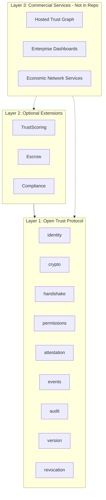

# Architecture

## Layered Diagram



## Data Flow

1. **Registration**: Admin creates org → registers agent with public key + capability manifest → server issues signed certificate.
2. **Verification**: Agent signs request (JWT with agent_id, scope, nonce, ts) → server verifies JWT, checks revocation, evaluates scope → returns valid/invalid.
3. **Handshake**: Agent sends handshake JWT (requested_scopes, nonce, ts) → server verifies, returns session proposal.
4. **Trust Events**: Agent or system records success/failure/SLA → trust engine computes score.

## Handshake Lifecycle

```
Client                          Server
  |                                |
  |-- POST /handshake/verify ----->|
  |   { agent_id, handshake_req_jws, requested_scopes, nonce, timestamp }
  |                                |
  |                                |-- Check revocation
  |                                |-- Verify JWT (public key)
  |                                |-- Check protocol_version
  |                                |-- Validate timestamp skew
  |                                |-- Validate nonce + scopes
  |<-- { valid, session_proposal } -|
  |                                |
  |-- POST /handshake/session ---->|  (admin auth)
  |   { agent_id, accepted_scopes }
  |                                |
  |<-- { session_token } ----------|
```

## Extension Injection Model

The server injects implementations for:

- **IssuerSigner**: Signs certificates (file JWK or KMS)
- **AuditWriter**: Writes audit logs (e.g. Postgres)
- **RevocationProvider**: Checks if agent is revoked (e.g. Postgres + Redis)
- **TrustScoring** (optional): Computes risk score from attestation graph

Protocol defines interfaces; server provides implementations. No A2AX-specific infrastructure required.

## Governance Boundaries

- **Protocol**: No imports from `/sdk`, `/extensions`, admin, billing, enterprise, onboarding, analytics.
- **Extensions**: Depend on protocol only; no implementations in interfaces.
- **Server**: Depends on protocol + extensions; implements storage, auth, metrics.

## Example Fork Scenario

1. Fork this repo.
2. Build `protocol/` in isolation (`npm run build` in protocol).
3. Replace server implementation: use your own Postgres, Redis, or different storage.
4. Implement `RevocationProvider`, `AuditWriter`, `IssuerSigner` with your infrastructure.
5. Deploy. The protocol verifies agents without any A2AX-operated services.

The protocol compiles, runs tests, and verifies agents even if A2AX (the company) disappears.
